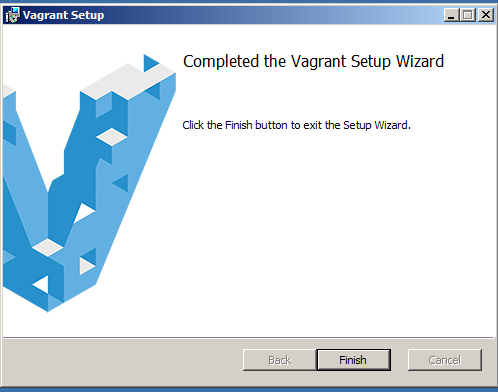

5. Install Vagrant
==================

Background
^^^^^^^^^^

Vagrant is an open source (free) software package that will allow you to run scripts to more easily and reliably install and configure software.

It is very useful for installing simple as well as complex software.

A single Vagrant script will install the bulk of the operating environment for Open edX.

The Vagrant software version we will use is 1.5.4.

Note that earlier or more recent versions of this package need not necessarily work. So, be sure to get this version, in particular.

The homepage for Vagrant is here: https://www.vagrantup.com/

You can find the Vagrant Version 1.5.4 that you need for 64-bit Windows here:

#. Vagrant 1.5.4 - https://dl.bintray.com/mitchellh/vagrant/vagrant_1.5.4.msi 

| 
Installing VirtualBox
^^^^^^^^^^^^^^^^^^^^^

Installing Vagrant is very easy:

1. Click the downloaded installer for your operating system
2. Follow the prompts. Accept all of the default option settings.
3. Once installed, reboot your computer.

The Vagrant installer updated the path system variable with the location of the program.

