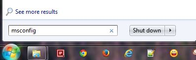
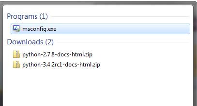
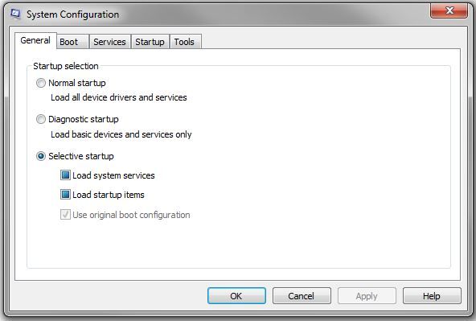
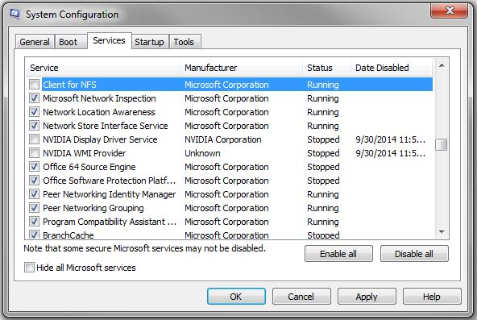
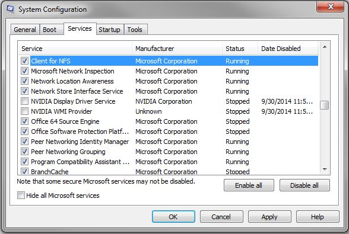

Windows 7 Enterprise Installation
=================================
Windows 7 Enterprise will be the base operating system onto which all the other software will be installed.

We will refer to it as the *host* operating system.

The Enterprise version will be used, and not the Professional version, because Client for Network File System (NFS) is required, 
and it is not included in Windows 7 Professional.

(Windows 7 Ultimate also includes Client for NFS, so that it can be used as well.)

Installing Windows 7 Enterprise
--------------------------------

After installing Windows 7 Enterprise, you must ensure that Client for Network File System (NFS) services have been enabled.

We can use the msconfig.exe Windows 7 systems program to enable it.

msconfig.exe is the program that displays the programs that have been installed as Windows 7 services. It can also be used to enable or disable the services.

To enable Client for NFS, you can follow these steps:

1. Click the Start button at the bottom left of the Windows Start menu.
   Then type msconfig into the text box just above the menu bar, as shown below:

|

 
|

2. msconfig.exe will display at the top of the Search results. Click it.

(Or you could enter the complete name msconfig.exe and press ENTER in the textbox.)

Doing so will launch the msconfig.exe program.

|
3. Once the dialog box displays, click the Services tab.

|

4. Scroll through the list until you locate Client for NFS

|
5. Once found, ensure that it is checked. 

That completes the process for enabling the Client for NFS service.

That is the only initial Windows 7 Enterprise configuration needed for the Open edX platform.

