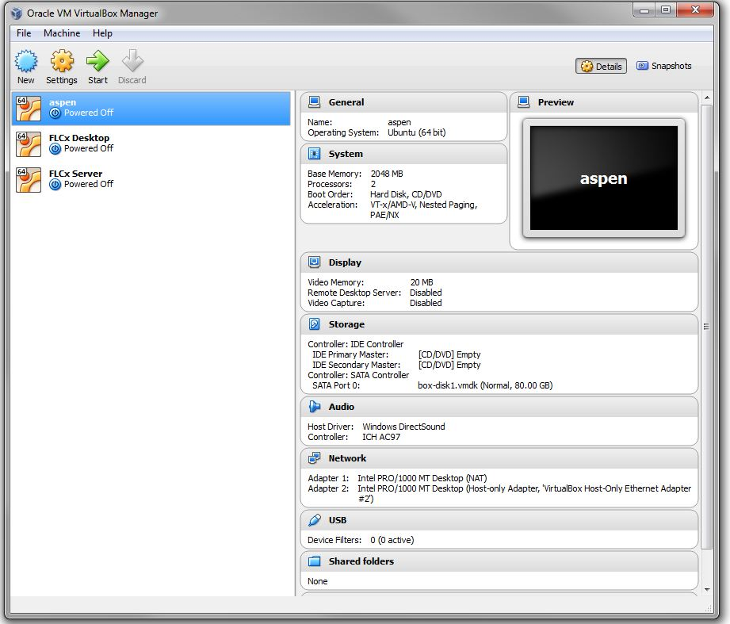

2. Oracle VirtualBox
====================

Oracle VirtualBox is an open source (free) software package that allows you to install additional operating systems onto your computer.

VirtualBox extends the capabilities of your existing computer so that it can run multiple operating systems (inside multiple virtual machines) at the same time.

Oracle VirtualBox Version 4.3.16
--------------------------------

|

Oracle VirtualBox Version 4.3.16 Installation
---------------------------------------------

To install Open edX, we will use Oracle VirtualBox Version 4.3.16, and the companion extension pack for it.

Note that earlier, or more recent, versions of this package might not necessarily work. So, be sure to get this version, in particular.

The homepage for Oracle VirtualBox is here: https://www.virtualbox.org/

You can find the versions you need for 64-bit Windows 7 here:

#. VirtualBox 4.3.16 - http://download.virtualbox.org/virtualbox/4.3.16/VirtualBox-4.3.16-95972-Win.exe 
#. VirtualBox 4.3.16 Extension Pack - http://download.virtualbox.org/virtualbox/4.3.16/Oracle_VM_Virtualx_Extension_Pack-4.3.16-95972.vbox-extpack

|
To Install Virtualbox
^^^^^^^^^^^^^^^^^^^^^
#. Click the previously downloaded VirtualBox-4.3.16-95972-Win.exe setup program
#. At the 
